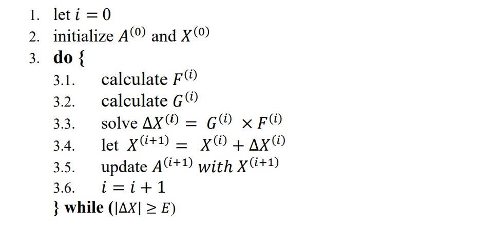

# Matrix-Solver-Algorithm-Hardware-Implementation
Implementation of a matrix equation solver algorithm (the following algorithm) in VHDL for the final project of my Design Automation (FPGA) course

